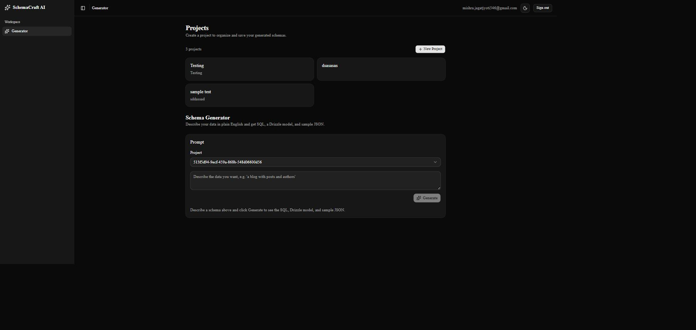
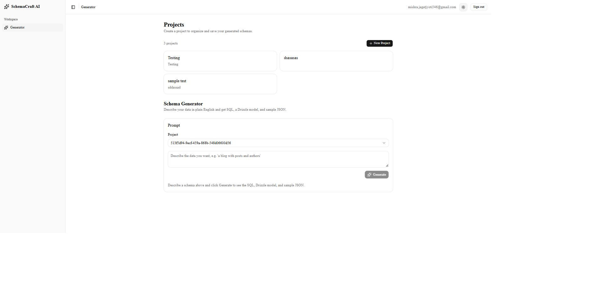
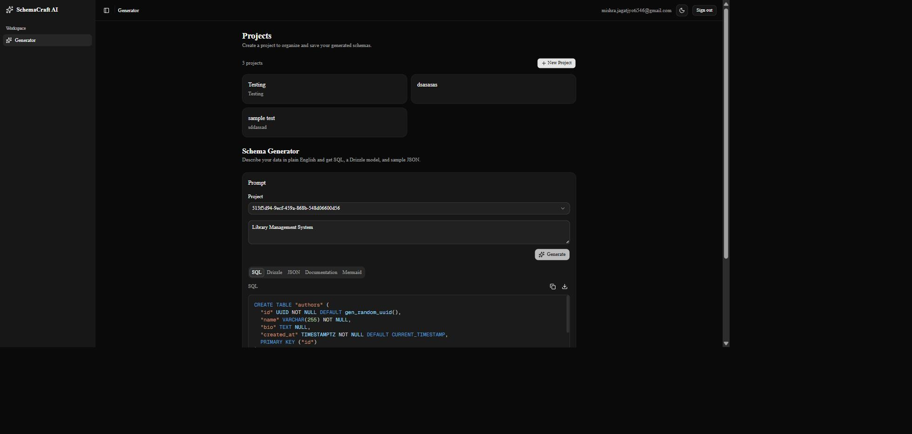
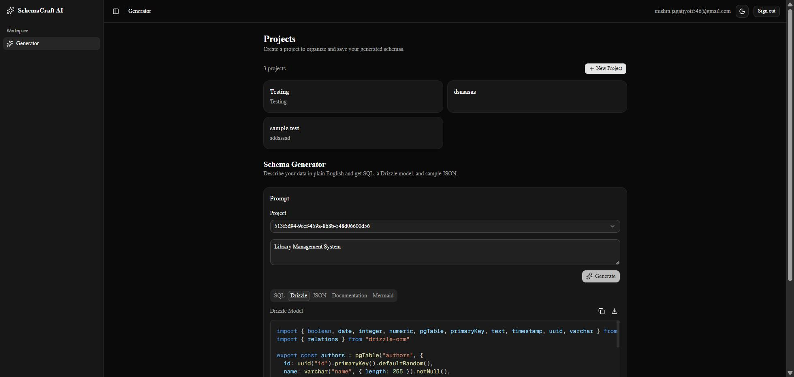
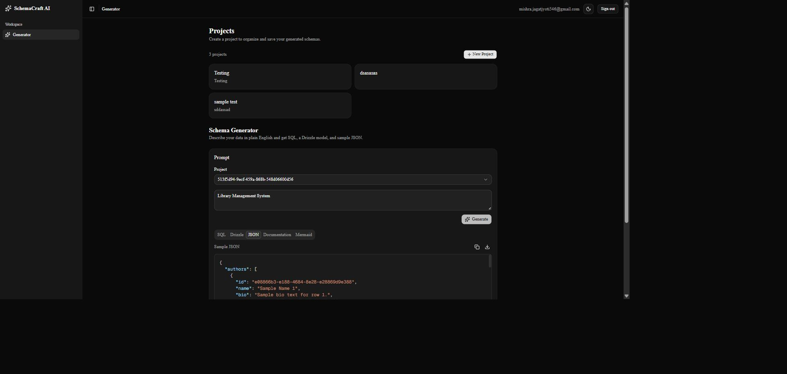
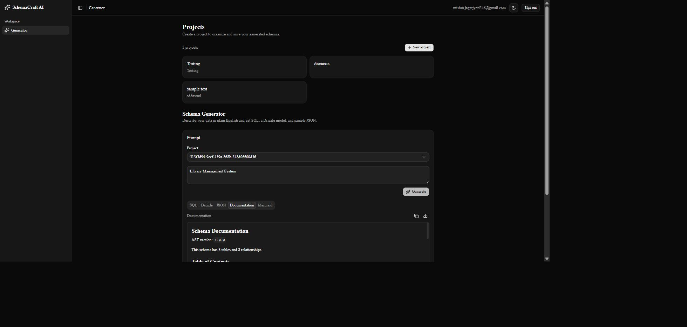
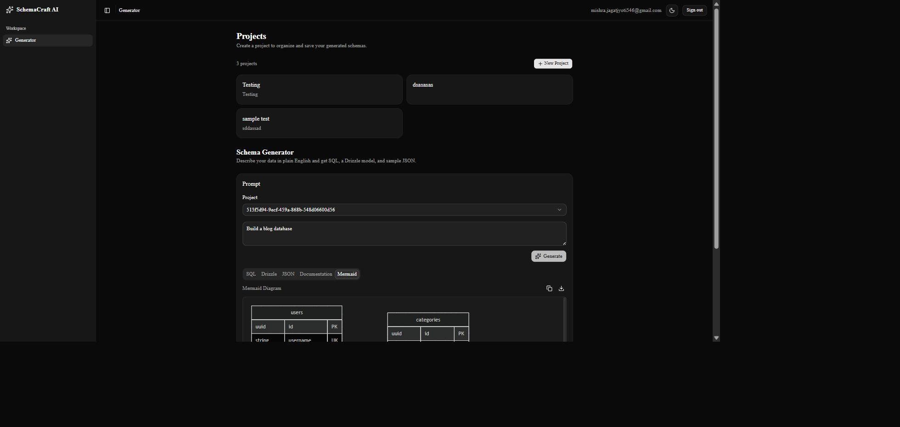

# SchemaCraft AI

**Turn a plain-English description into a production-ready database schema.**

SchemaCraft AI is an AI-powered developer tool that converts natural language prompts into a complete set of database artifacts: SQL DDL, a Drizzle ORM model, realistic sample JSON, Markdown documentation, and a Mermaid ER diagram — all generated from a single, deterministic pipeline so every artifact stays consistent with every other.

🔗 **Live Demo:** [schemacraft-ai.vercel.app](https://schemacraft-ai.vercel.app)
📦 **Repository:** [github.com/jagat546/schemacraft-ai](https://github.com/jagat546/schemacraft-ai)

---

## Overview

Describe your data ("a blog with posts and authors", "a hospital management system") and SchemaCraft AI returns:

- A ready-to-run **PostgreSQL schema**
- A matching **Drizzle ORM** model
- **Realistic sample JSON** for every table
- Readable **Markdown documentation**
- A rendered **Mermaid ER diagram**

Under the hood, the AI model never generates these five artifacts directly. It produces exactly one thing — a **Canonical Schema AST** — which is then validated, semantically analyzed, and deterministically compiled into all five outputs. This means the SQL and the Drizzle model can never disagree with each other: they're both compiled from the same source of truth in the same run.

---

## Features

- **Natural language → SQL schema** — primary keys, foreign keys, constraints, and indexes
- **Drizzle ORM generation** — matches this project's own schema conventions (camelCase properties, `relations()` blocks, correct builder types)
- **Sample JSON generation** — deterministic, relationally-correct sample rows per table
- **Markdown documentation** — table of contents, per-table column tables, relationships section
- **Mermaid ER diagrams** — rendered live in the browser, with inferred cardinality and PK/FK/UK tags
- **Project-based organization** — save and revisit generations under named projects
- **Dark / light / system theme**

---

## Architecture

```
Prompt (UI)
   │
   ▼
Server Action — auth + input validation (zod)
   │
   ▼
Gemini AI — produces exactly one artifact: a Canonical Schema AST
   │
   ▼
AST Validation — structural (Zod) + version check
   │
   ▼
Semantic Analyzer — dangling FKs, duplicate names, unsafe expressions, etc.
   │
   ▼
Compiler Registry — 5 independent, deterministic compilers run against the same AST
   ├──▶ SQL (PostgreSQL)
   ├──▶ Drizzle ORM
   ├──▶ JSON sample data
   ├──▶ Markdown documentation
   └──▶ Mermaid ER diagram
   │
   ▼
Persistence — Supabase (Postgres + Row Level Security)
```

Every compiler is a pure function (`AST → string`) with no network calls, no filesystem access, and no non-deterministic input (`Math.random`, `Date.now`, etc.) — the same AST always produces byte-identical output. See [`ARCHITECTURE.md`](./ARCHITECTURE.md) for the full design, including the AST schema, the semantic-analysis rules, and each compiler's implementation details.

---

## Technology Stack

| Layer | Technology |
|---|---|
| Framework | [Next.js 16](https://nextjs.org) (App Router, React Server Components) |
| Language | TypeScript |
| Styling | Tailwind CSS + [shadcn/ui](https://ui.shadcn.com) |
| AI | Google Gemini (`@google/genai`) |
| Database | Supabase (PostgreSQL + Row Level Security) |
| ORM | Drizzle ORM |
| Diagrams | Mermaid |
| Testing | Vitest |
| CI | GitHub Actions |
| Hosting | Vercel |

---

## Installation

```bash
git clone https://github.com/jagat546/schemacraft-ai.git
cd schemacraft-ai
npm install
```

## Environment Variables

Copy `.env.example` to `.env.local` and fill in the values:

```bash
cp .env.example .env.local
```

| Variable | Description |
|---|---|
| `DATABASE_URL` | Postgres connection string (used by Drizzle Kit for local migrations only — not the runtime data path) |
| `NEXT_PUBLIC_SUPABASE_URL` | Your Supabase project URL |
| `NEXT_PUBLIC_SUPABASE_ANON_KEY` | Your Supabase anon/public API key |
| `GEMINI_API_KEY` | Google Gemini API key |

## Local Development

```bash
npm run dev
```

Open [http://localhost:3000](http://localhost:3000).

Other useful scripts:

```bash
npm run db:migrate   # apply Drizzle migrations locally
npm run db:studio    # browse the local database with Drizzle Studio
npm run lint          # ESLint
npm run typecheck     # tsc --noEmit
```

## Testing

```bash
npm test
```

The project has **149 automated tests** across 9 test files, covering the AST validator, the semantic analyzer, all 5 compilers (SQL, Drizzle, JSON, Markdown, Mermaid), and the generation-service integration seam. Every compiler has both a hand-verified expected-output test and a determinism test (compile twice, assert byte-identical output) — no snapshot testing, since the whole point of these compilers is deterministic, human-reviewable output, and a snapshot would rubber-stamp any accidental change instead of catching it.

**GitHub Actions CI** (`.github/workflows/ci.yml`) runs on every push and pull request to `main`: install → lint → typecheck → test → build. All four steps must pass before a change is considered mergeable.

## Production Deployment

The application is deployed on **Vercel** at [schemacraft-ai.vercel.app](https://schemacraft-ai.vercel.app), backed by **Supabase** for auth, database, and Row Level Security. Production has been validated end-to-end: every generation flow, all five output artifacts, database persistence, duplicate-submission handling, and a battery of negative-input tests (empty/whitespace/oversized/emoji/injection-style prompts) all pass with zero console errors and zero real network failures.

---

## Screenshots

**Dashboard — dark mode**


**Dashboard — light mode**


**Generated SQL**


**Generated Drizzle ORM model**


**Generated sample JSON**


**Generated documentation**


**Generated Mermaid ER diagram**


---

## Roadmap

- [x] **Milestone 1 — Test Infrastructure & CI** ✅ *Complete* — 149 automated tests, GitHub Actions CI, production deployment validated end-to-end.
- [ ] **Milestone 2 — Critical Bug Fixes** — project-selector display name, FK-column auto-indexing, join-table composite-uniqueness warning.
- [ ] **Milestone 3 — History & Navigation UI** — browse, view, and delete past generations per project.
- [ ] **Milestone 4 — Deployment & Ops Hardening** — Git↔Vercel integration, production data cleanup.
- [ ] **Milestone 5 — Compiler & Prompt Quality Polish** — smarter type sizing, richer sample data, CSP headers.

See [`docs/planning/v0.7.1-roadmap.md`](./docs/planning/v0.7.1-roadmap.md) for the full technical roadmap.

---

## License

Released under the [MIT License](./LICENSE).

## Author

**Jagat Jyoti Mishra**
